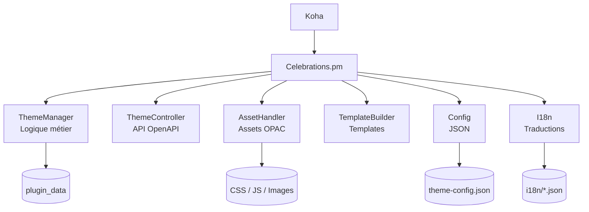
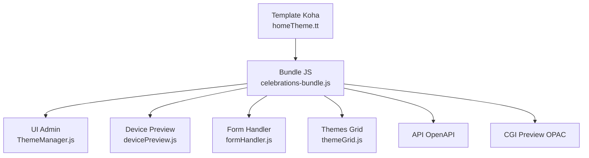

# Architecture – extension Koha Celebrations

[](README.fr.md)

Ce document décrit **en détail l’architecture interne** de l'extension Koha **Celebrations**.
Il complète le `README.md` principal en fournissant une vue approfondie des composants backend et frontend, de leur organisation et de leurs interactions.

<br>

#### Table des matières


- [Objectifs d’architecture](#objectifs-darchitecture)
- [Vue d’ensemble](#vue-densemble)
- [Organisation du dépôt](#organisation-du-dépôt)
- [Architecture backend](#architecture-backend)
  - [Rôle du backend](#rôle-du-backend)
  - [Diagramme backend](#diagramme-backend)
  - [Composants backend](#composants-backend)
- [Architecture frontend](#architecture-frontend)
  - [Rôle du frontend](#rôle-du-frontend)
  - [Bundling JavaScript](#bundling-javascript)
  - [Diagramme frontend](#diagramme-frontend)
  - [Composants frontend](#composants-frontend)
- [Architecture data-driven](#architecture-data-driven)
  - [Avantages](#avantages)
- [Tests et validation](#tests-et-validation)
- [Conclusion](#conclusion)

<br>

## Objectifs d’architecture

L’architecture de l'extension **Celebrations** a été conçue pour répondre aux objectifs suivants :

* **Stabilité** : intégration propre avec Koha sans modifier le cœur.
* **Maintenabilité** : séparation claire des responsabilités.
* **Extensibilité** : ajout de nouveaux thèmes sans modification du code Perl.
* **Data-driven** : génération dynamique de l’interface à partir de fichiers JSON.
* **Séparation frontend / backend** stricte.

<br>

## Vue d’ensemble

L'extension repose sur :

* un **backend Perl** responsable de la logique métier, de la persistance et de l’API,
* un **frontend JavaScript** chargé de l’interface d’administration et de la prévisualisation,
* une **configuration JSON** décrivant entièrement les thèmes et leurs options.

<br>

## Organisation du dépôt

```text
Koha/Plugin/
 └── Celebrations.pm                    # Implémente les hooks Koha et délège la logique métier aux modules Lib/*

Koha/Plugin/Celebrations/
 ├── api/
 │    ├── api_routes.json               # Routes de configuration des thèmes
 │    ├── css.json                      # Routes des fichiers static css
 │    ├── images.json                   # Routes des images
 │    └── js.json                       # Routes des fichiers static js
 ├── config/
 │    ├── theme-config.json             # Fichier de configuration des thème ("Data-driven")
 │    └── theme-config.schema.json      # Schéma de la configuration
 ├── css/
 |    ├── <NomTheme>/
 |    │    └── <NomÉlémentVisuel>.css   # Fichiers CSS de chaque éléments visuel du theme
 │    └── template/
 |         ├── disabled-css.tt          # CSS de l’interface admin désactivé
 |         └── homeTheme.css            # CSS de l’interface admin activé
 ├── i18n/
 |    ├── disabled-css.tt               # Traduction par défaut en anglais
 |    └── homeTheme.css                 # Traduction en francais
 ├── images/                            # contient les images utilisées par l'extension
 ├── js/
 │    ├── dist/
 │    |    └── celebration-bundle.js    # Bundle compilé de la page de configuration
 |    ├── <NomTheme>/
 |    │    └── <NomÉlémentVisuel>.js    # Fichiers JS de chaque éléments visuel du theme
 │    └── template/
 │         ├── config.js                # Configuration Générale
 │         ├── devicePreview.js         # Système de prévisualisation multi-device
 │         ├── formHandler.js           # Gestion du formulaire de thème
 │         ├── main.js                  # Script principal du module de gestion des thèmes
 │         ├── themeGrid.js             # Gestion de la grille des thèmes
 │         ├── themeOptions.js          # Gestion du menu de configuration des options de thème
 |         └── utils.js                 # Utilitaires généraux de l'extension Celebrations
 ├── Lib/
 │    ├── AssetHanfler.pm               # Gestionnaire de ressources CSS/JS et ressources des thèmes
 │    ├── Config.pm                     # Gestionnaire de configuration des thèmes
 │    ├── I18n.pm                       # Gestionnaire de traductions
 │    ├── TemplateBuilder.pm            # Constructeur de templates
 │    ├── ThemeController.pm            # Contrôleur REST des thèmes
 │    └── ThemeManager.pm               # Gestionnaire de thèmes
 └─── template/
      ├── disabled.tt                   # Template quand l'extension est désactivé
      ├── homeTheme.tt                  # Template quand l'extension est activé

 scripts/
 ├── bundle-plugin-js.js                # Script de bundling pour le js de la page de configuration
 └── test-env.sh                        # Script qui permet l'automatisation du lancement des tests

 t/
 ├── 01-load.t                          # Test de chargement
 ├── 02-critic.t                        # Test du code Perl
 ├── 03-lifecycle.t                     # Test de désinstallation
 ├── 04-translation.t                   # Test de validité des fichier de langue I18N
 └── 05-config.t                        # test de validité du fichier theme-config.json
```

Cette organisation permet :

* une lecture rapide du projet,
* une distinction nette entre code métier, configuration et assets.

<br>

## Architecture backend

### Rôle du backend

Le backend est responsable de :

* la **gestion des thèmes** (création, mise à jour, activation),
* la **validation des périodes et conflits**,
* la **persistance des données** (`plugin_data`),
* l’**exposition d’une API REST OpenAPI**,
* la **mise à disposition des ressources statiques** via l’API Koha.

### Diagramme backend



<br>

### Composants backend

#### `Celebrations.pm`

* Point d’entrée unique de l'extension.
* Implémente les hooks Koha.
* Enregistre les routes API et statiques.
* Délègue toute la logique métier aux modules `Lib/`.

#### `ThemeManager.pm`

Cœur métier de l'extension :

* validation des dates (start / end),
* détection des conflits,
* activation d’un thème,
* persistance dans `plugin_data`.

#### `ThemeController.pm`

* Contrôleur REST exposé via OpenAPI.
* Point d’accès pour le frontend JavaScript.

#### `AssetHandler.pm`

* Gestion de l’injection CSS / JS dans l’OPAC.
* Fourniture des assets de prévisualisation.

#### `TemplateBuilder.pm`

* Construction des interfaces Intranet et OPAC.
* Prévisualisation iframe.

#### `Config.pm` et `I18n.pm`

* Chargement de la configuration JSON.
* Chargement et validation des traductions.

<br>

## Architecture frontend

### Rôle du frontend

Le frontend fournit :

* l’**interface d’administration**,
* la **prévisualisation OPAC multi-device**,
* la **communication avec le backend**.

Il ne contient **aucune logique métier**.

### Bundling JavaScript

* Tous les fichiers JS du dossier `js/template/` sont regroupés
* en un **bundle unique** :

```text
js/dist/celebrations-bundle.js
```

Ce bundle est chargé par les templates Koha.

<br>

### Diagramme frontend



<br>

### Composants frontend

#### `celebrations-bundle.js`

* Point d’entrée frontend.
* Orchestration globale de l’interface.

#### `ThemeManager.js`

* Gestion de l’état UI.
* Coordination des modules.

#### `devicePreview.js`

* Gestion de la prévisualisation OPAC.
* Iframe, redimensionnement, injection d’assets.

#### `formHandler.js`, `themeGrid.js`, `themeOptions.js`

* Gestion des formulaires.
* Affichage et interaction avec les thèmes.
* Communication avec l’API backend.

<br>

## Architecture data-driven

L'extension est entièrement **orienté données** :

* les thèmes,
* leurs éléments visuels,
* leurs options,

sont décrits dans :

```text
config/theme-config.json
```

L’interface d’administration est générée dynamiquement à partir de cette configuration.

### Avantages

* ajout d’un thème **sans modifier le code Perl**,
* cohérence automatique frontend / backend,
* validation via schéma JSON.

<br>

## Tests et validation

L'extension inclut une suite de tests automatisés :

* chargement de l'extension,
* respect des bonnes pratiques Perl,
* cycle de vie de l'extension,
* cohérence des traductions,
* validation de la configuration JSON.

Ces tests garantissent la **robustesse de l’architecture**.

<br>

## Conclusion

L’architecture de l'extension **Celebrations** repose sur une séparation claire :

* **backend Perl** (métier, API, persistance),
* **frontend JavaScript** (interface et prévisualisation),
* **configuration JSON** (data-driven).

Cette approche garantit une extension **fiable, extensible et maintenable**, parfaitement intégré à l’écosystème Koha.

<br>

---

[](README.fr.md)
