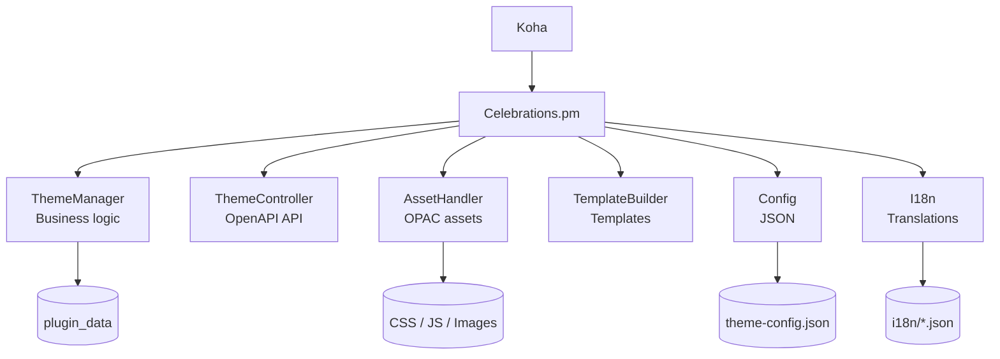
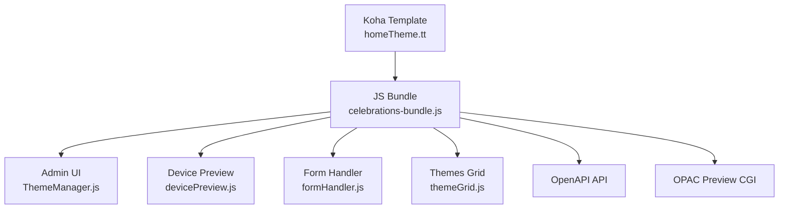

# Architecture - Koha Plugin Celebrations

[](../README.md)

This document describes **in detail the internal architecture** of the Koha **Celebrations** plugin.
It complements the main `README.md` by providing an in-depth view of the backend and frontend components, their organization, and their interactions.

<br>

## Table of contents

- [Table of contents](#table-of-contents)
- [Architecture Objectives](#architecture-objectives)
- [Overview](#overview)
- [Repository Layout](#repository-layout)
- [Backend Architecture](#backend-architecture)
  - [Backend Role](#backend-role)
  - [Backend Diagram](#backend-diagram)
  - [Backend Components](#backend-components)
- [Frontend Architecture](#frontend-architecture)
  - [Frontend Role](#frontend-role)
  - [JavaScript Bundling](#javascript-bundling)
  - [Frontend Diagram](#frontend-diagram)
  - [Frontend Components](#frontend-components)
- [Data-Driven Architecture](#data-driven-architecture)
  - [Advantages](#advantages)
- [Tests and Validation](#tests-and-validation)
- [Conclusion](#conclusion)

<br>

## Architecture Objectives

The architecture of the **Celebrations** plugin was designed to meet the following goals:

* **Stability**: clean integration with Koha without modifying the core.
* **Maintainability**: clear separation of responsibilities.
* **Extensibility**: add new themes without changing Perl code.
* **Data-driven**: dynamically generate the interface from JSON files.
* Strict **frontend / backend** separation.

<br>

## Overview

The plugin relies on:

* a **Perl backend** responsible for business logic, persistence, and the API,
* a **JavaScript frontend** responsible for the admin interface and preview,
* a **JSON configuration** fully describing the themes and their options.

<br>

## Repository Layout

```text
Koha/Plugin/
 └── Celebrations.pm                    # Implements Koha hooks and delegates business logic to Lib/*

Koha/Plugin/Celebrations/
 ├── api/
 │    ├── api_routes.json               # Theme configuration routes
 │    ├── css.json                      # Static CSS routes
 │    ├── images.json                   # Image routes
 │    └── js.json                       # Static JS routes
 ├── config/
 │    ├── theme-config.json             # Theme configuration file ("Data-driven")
 │    └── theme-config.schema.json      # Configuration schema
 ├── css/
 |    ├── <ThemeName>/
 |    │    └── <VisualElementName>.css  # CSS files for each visual element of the theme
 │    └── template/
 |         ├── disabled-css.tt          # Disabled admin interface CSS
 |         └── homeTheme.css            # Enabled admin interface CSS
 ├── i18n/
 |    ├── disabled-css.tt               # Default English translation
 |    └── homeTheme.css                 # French translation
 ├── images/                            # Contains images used by the plugin
 ├── js/
 │    ├── dist/
 │    |    └── celebration-bundle.js    # Compiled bundle for the configuration page
 |    ├── <ThemeName>/
 |    │    └── <VisualElementName>.js   # JS files for each visual element of the theme
 │    └── template/
 │         ├── config.js                # General configuration
 │         ├── devicePreview.js         # Multi-device preview system
 │         ├── formHandler.js           # Theme form handling
 │         ├── main.js                  # Main script of the theme management module
 │         ├── themeGrid.js             # Theme grid handling
 │         ├── themeOptions.js          # Theme option menu handling
 |         └── utils.js                 # General utilities for the Celebrations plugin
 ├── Lib/
 │    ├── AssetHanfler.pm               # CSS/JS asset manager and theme assets
 │    ├── Config.pm                     # Configuration manager for the Celebrations plugin themes
 │    ├── I18n.pm                       # Translation manager for the Celebrations plugin
 │    ├── TemplateBuilder.pm            # Template builder for the Celebrations plugin
 │    ├── ThemeController.pm            # REST controller of the themes for the Celebrations plugin
 │    └── ThemeManager.pm               # Theme manager for the Celebrations plugin
 └─── template/
      ├── disabled.tt                   # Template when the plugin is disabled
      ├── homeTheme.tt                  # Template when the plugin is enabled

 scripts/
 ├── bundle-plugin-js.js                # Bundling script for the JS of the configuration page
 └── test-env.sh                        # Script enabling automated test launches

 t/
 ├── 01-load.t                          # Load test
 ├── 02-critic.t                        # Perl code test
 ├── 03-lifecycle.t                     # Uninstallation test
 ├── 04-translation.t                   # Translation validity test for I18N language files
 └── 05-config.t                        # Validation test for the theme-config.json file
```

This organization allows:

* quick project reading,
* a clear distinction between business code, configuration, and assets.

<br>

## Backend Architecture

### Backend Role

The backend is responsible for:

* **theme management** (creation, update, activation),
* **validation of periods and conflicts**,
* **data persistence** (`plugin_data`),
* **exposing an OpenAPI REST API**,
* **making static resources available** via the Koha API.

### Backend Diagram



<br>

### Backend Components

#### `Celebrations.pm`

* Single entry point of the plugin.
* Implements Koha hooks.
* Registers API and static routes.
* Delegates all business logic to the `Lib/` modules.

#### `ThemeManager.pm`

Business core of the plugin:

* date validation (start / end),
* conflict detection,
* theme activation,
* persistence in `plugin_data`.

#### `ThemeController.pm`

* REST controller exposed via OpenAPI.
* Entry point for the JavaScript frontend.

#### `AssetHandler.pm`

* Manages CSS / JS injection into the OPAC.
* Provides preview assets.

#### `TemplateBuilder.pm`

* Builds the Intranet and OPAC interfaces.
* Iframe preview.

#### `Config.pm` and `I18n.pm`

* Load JSON configuration.
* Load and validate translations.

<br>

## Frontend Architecture

### Frontend Role

The frontend provides:

* the **administration interface**,
* the **multi-device OPAC preview**,
* **communication with the backend**.

It contains **no business logic**.

### JavaScript Bundling

* All JS files in the `js/template/` folder are grouped
* into a **single bundle**:

```text
js/dist/celebrations-bundle.js
```

This bundle is loaded by the Koha templates.

<br>

### Frontend Diagram



<br>

### Frontend Components

#### `celebrations-bundle.js`

* Frontend entry point.
* Global orchestration of the interface.

#### `ThemeManager.js`

* UI state management.
* Coordination of modules.

#### `devicePreview.js`

* OPAC preview management.
* Iframe, resizing, asset injection.

#### `formHandler.js`, `themeGrid.js`, `themeOptions.js`

* Form handling.
* Display and interaction with themes.
* Communication with the backend API.

<br>

## Data-Driven Architecture

The plugin is entirely **data-driven**:

* the themes,
* their visual elements,
* their options,

are described in:

```text
config/theme-config.json
```

The administration interface is dynamically generated from this configuration.

### Advantages

* add a theme **without modifying the Perl code**,
* automatic frontend / backend consistency,
* validation via JSON schema.

<br>

## Tests and Validation

The plugin includes an automated test suite:

* plugin loading,
* adherence to Perl best practices,
* plugin lifecycle,
* translation consistency,
* JSON configuration validation.

These tests ensure the **robustness of the architecture**.

<br>

## Conclusion

The architecture of the **Celebrations** plugin relies on a clear separation:

* **Perl backend** (business logic, API, persistence),
* **JavaScript frontend** (interface and preview),
* **JSON configuration** (data-driven).

This approach ensures a **reliable, extensible, and maintainable** plugin, perfectly integrated into the Koha ecosystem.

<br>

---

[](../README.md)